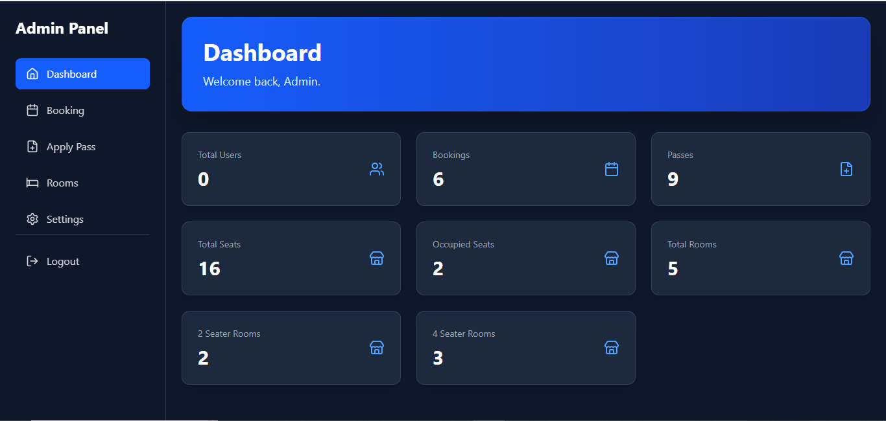
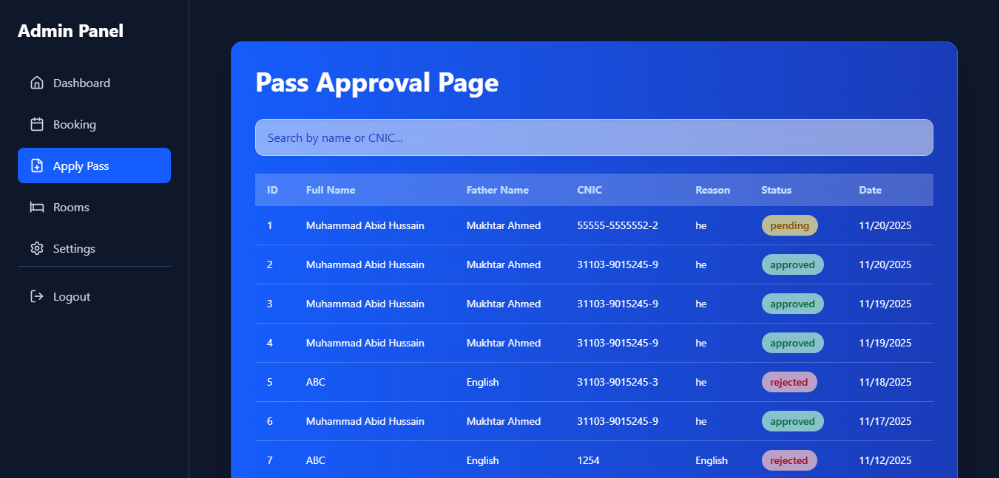
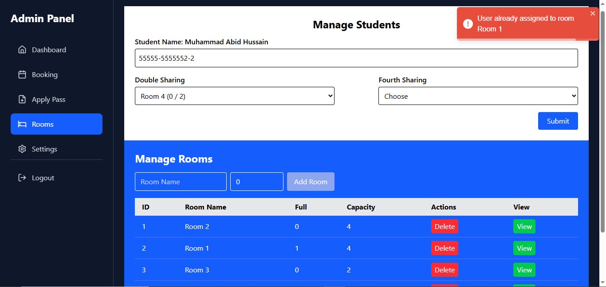
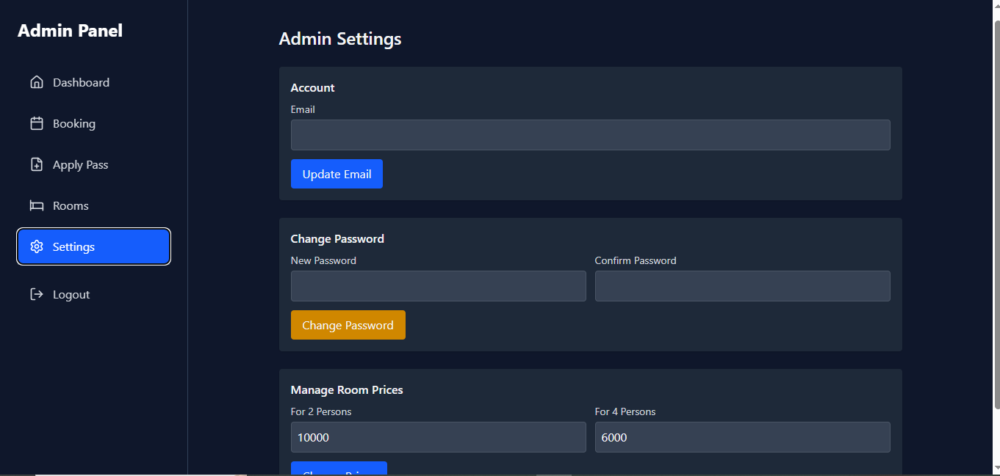
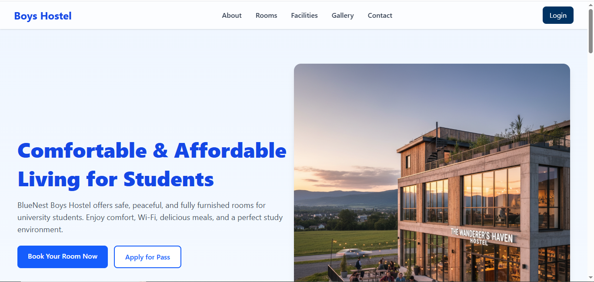

# Hostel Management System -- MERN + MySQL

A full stack hostel management system built with the MERN stack and
MySQL as the database. The system provides separate user and admin
workflows, allowing students to apply for room bookings and passes while
giving administrators full control over hostel operations.

## ScreenShots

## Features

### User Panel

-   Apply for room booking
-   Submit hostel pass requests
-   View application status
-   Simple and responsive interface

### Admin Panel

-   View all room availability and filled capacity
-   Manage bookings, approve or reject requests
-   Assign room numbers to accepted applications
-   Approve and manage pass requests
-   Manage website content
-   Dashboard with stats for rooms, bookings, passes, and occupancy

## Tech Stack

### Frontend

-   React
-   Vite / Next.js
-   Tailwind CSS / Material UI

### Backend

-   Node.js
-   Express.js
-   REST API

### Database

-   MySQL

### Other Tools

-   JWT Authentication
-   bcrypt

## How to Run the Project

### 1. Clone the Repository

    git clone https://github.com/Dev-Zone-Developer/MERN-Hostel-Management-website.git
    cd MERN-Hostel-Management-Website

### 2. Install Frontend Dependencies

    cd frontend
    npm install

### 3. Install Backend Dependencies

    cd ../backend
    npm install

### 4. Configure Environment Variables

Create or edit `.env` in Hostel Management Website:

    PORT=3500
    DB_HOST=localhost
    DB_USER=root
    DB_PASSWORD=yourpassword
    DB_NAME=hostel_db
    JWT_SECRET=your_secret

### 5. Start Backend

    npm start

### 6. Start Frontend

    npm run dev

## License

MIT License
